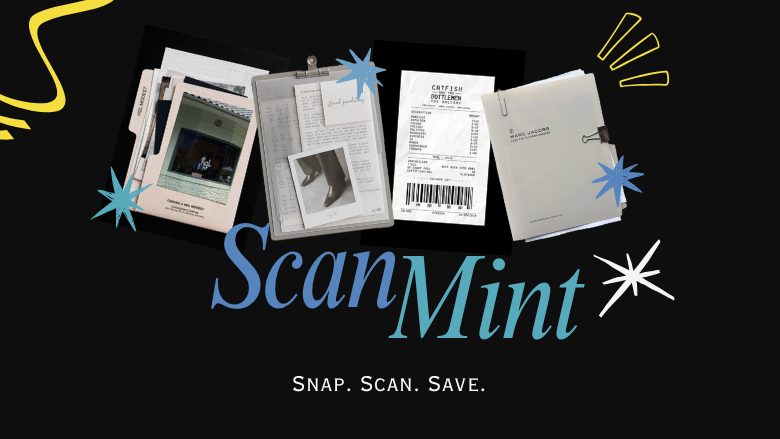

# ScanMint

Turn a photo of a receipt into structured expense data in one tap.

Point your camera at a receipt. ScanMint detects the edges, flattens the image, extracts the vendor, date, total, and line items with a vision model, and drops it into your receipts log with a running monthly total. Edit anything the model got wrong before you save.

**Current version: v0.1** 

---

## The pipeline

1. **Capture** — take a photo or upload one. Optional manual corner adjustment for tricky lighting.
2. **Flatten** — a five-pass Canny/HSV/Otsu cascade finds the receipt boundary and warps it to a clean top-down view.
3. **Extract** — the flattened image goes to a vision LLM that returns structured JSON: vendor, date, subtotal, tax, total, currency, category, line items.
4. **Review** — every field is editable in a card before it hits your log. Nothing saves without your tap.
5. **Track** — receipts land in Supabase with per-month totals surfaced in a Receipts tab.

---

## Stack

- **Frontend** — Next.js 15, mobile-first
- **Backend** — FastAPI + OpenCV for the perspective pipeline
- **Vision model** — Gemini (default), behind a provider abstraction so OpenAI, Groq, or Anthropic can swap in
- **Storage & auth** — Supabase (Postgres + Storage + Auth, guest-first)

---

## Running locally

Two terminals. Backend first.

### Backend (port 8000)

```bash
cd backend
python3 -m venv venv
source venv/bin/activate
pip install -r requirements.txt
cp .env.example .env
# fill in GEMINI_API_KEY, SUPABASE_URL, SUPABASE_SERVICE_ROLE_KEY
uvicorn main:app --reload --port 8000
```

Health check: `http://localhost:8000/health`

### Frontend (port 3000)

```bash
cd frontend
cp .env.example .env.local
# fill in NEXT_PUBLIC_SUPABASE_URL and NEXT_PUBLIC_SUPABASE_ANON_KEY
npm install
npm run dev
```

Open `http://localhost:3000`.

---

## Supabase setup

Apply the migrations:

```bash
supabase db push
```

Or paste each file in `supabase/migrations/` into the SQL editor in order.

Guest mode works out of the box. Sign in to persist receipts across devices.

---

## Research

ScanMint began as a course project, [SmartScan](https://github.com/mwlde/SmartScan), which paired an OpenCV preprocessing pipeline with a MobileNetV2 document classifier. The commercial evolution swaps the classifier for a vision LLM. What that swap costs and buys is written up in [RESEARCH.md](RESEARCH.md).

---

## License

MIT, see [LICENSE](LICENSE). Applies to application code. Trained model weights and third-party datasets from the SmartScan predecessor are not included in this repository.
